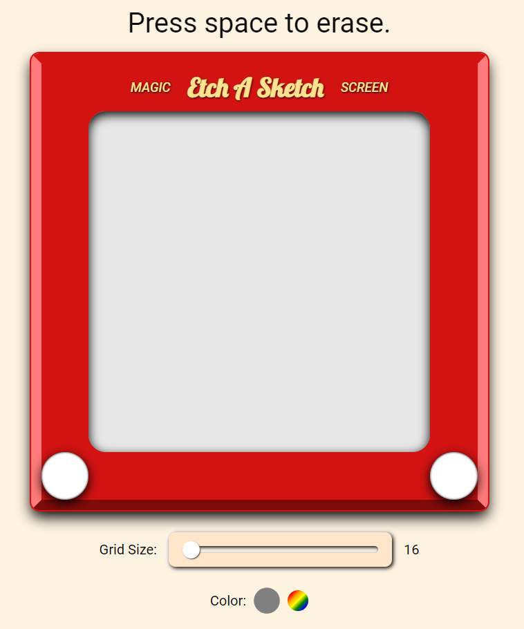

# The Odin Project: Etch-A-Sketch

## Project Scope
Implement a browser version of an Etch-A-Sketch-esque canvas.

Link: https://github.com/datderek/odin-etchasketch

### Conclusions
What I Learned From This Project:
* Great opportunity to practice and gain experience with using flexbox
* Didn't have too much trouble with the JavaScript aspect of the project
* Had some initial difficulties making the "Etch A Sketch" module responsive, but I was able to get there in the end

Areas to Improve Upon:
* Managing complexity - I found myself using a lot of repetitive classes (and attributes), that is I would overuse "display: flex" in areas that didn't need it. This overall led to a quickly confusing and messy DOM within my index.html and classes in my styles.css. Moving forward I intend to focus more on planning the website before I build it in order to produce a cleaner and more cohesive DOM and stylesheet.

